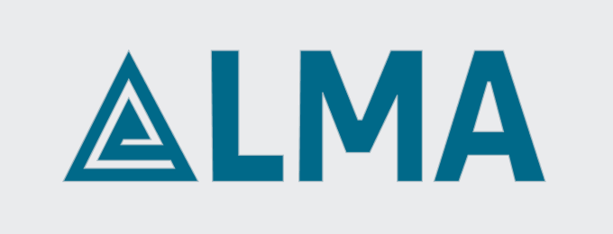

# FECAP - Fundação de Comércio Álvares Penteado

# Instituto Alma

## FrontLine

## Integrantes: <a href="https://www.linkedin.com/in/enzo-ribeiro/">Enzo Ribeiro da Silva</a>, <a href="https://www.linkedin.com/in/rikelmy-anacleto-07102006d18/">Rikelmy Anacleto</a>, <a href="https://www.linkedin.com/in/matheus-breda-andreo-6796b1350/">Matheus Andreo</a>, <a href="https://www.linkedin.com/in/lucas-camargo-souza/">Lucas Camargo</a>

## Professores Orientadores: <a href="https://www.linkedin.com/in/francisco-escobar/">Francisco de Souza Escobar</a>, <a href="https://www.linkedin.com/in/victorbarq/">Victor Bruno Alexander Rosetti de Quiroz</a>, <a href="https://www.linkedin.com/in/eduardo-savino-gomes-77833a10/">Eduardo Savino Gomes</a>, <a href="https://www.linkedin.com/in/ronaldo-araujo-pinto-3542811a/">Ronaldo Araujo Pinto</a>, <a href="https://www.linkedin.com/in/jbuesso/">José Carlos Buesso Jr</a>

## Descrição

##

Nós da FrontLine criamos o site do Instituto Alma para facilitar nas arrecadações e, indiretamente, ajudarmos mais pessoas. A missão é fortalecer uma comunidade e mostrar as ações solidárias para incentivar o bem e trazer mais pessoas para a comunidade.

## 🛠 Estrutura de pastas

-Raiz 
| 
|-->documentos 
  &emsp;|-->Entrega 1 
  &emsp;|-->Entrega 2 
  &emsp;|-->ReadME 
  &emsp;|Documentação.docx 
|-->src 
  &emsp;|-->Entrega 1 
  &emsp;|-->Entrega 2 
  &emsp;&emsp;|-->Front-End 
  &emsp;&emsp;|-->Back-End 
|-->imagens 
|readme.md 

## 📋 Licença/License
Utilize o link <https://chooser-beta.creativecommons.org/> para fazer uma licença CC BY 4.0.

## 🎓 Referências

Aqui estão as referências usadas no projeto.

1. <https://github.com/iuricode/readme-template>
2. <https://github.com/gabrieldejesus/readme-model>
3. <https://chooser-beta.creativecommons.org/>
4. <https://freesound.org/>
5. <https://www.toptal.com/developers/gitignore>
6. Músicas por: <a href="https://freesound.org/people/DaveJf/sounds/616544/"> DaveJf </a> e <a href="https://freesound.org/people/DRFX/sounds/338986/"> DRFX </a> ambas com Licença CC 0.
